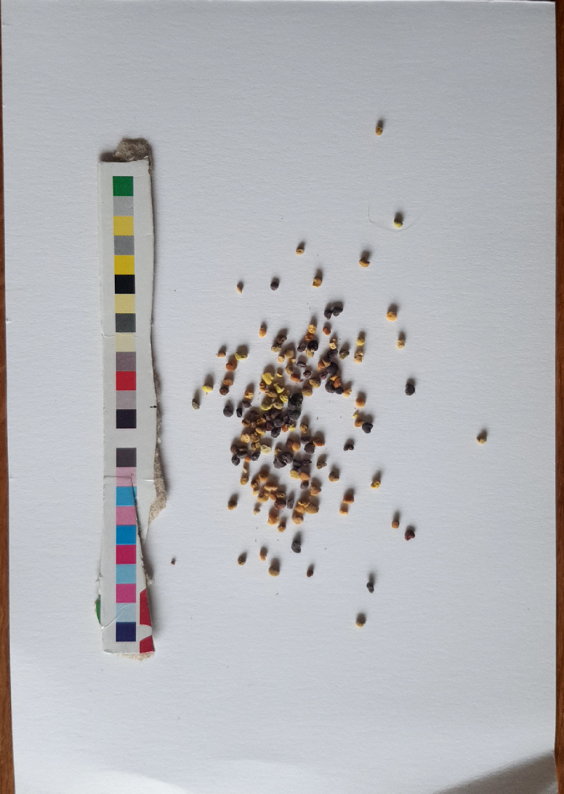

# About this repo

Calibration of mobile phone images using print test strips.

This *beesycc* repo was published together with the paper [Introducing Pollenyzer: An app for automatic determination of colour diversity for corbicular pollen loads](https://doi.org/10.1016/j.atech.2023.100263) and offers the possibility to use print test strip for calibration of mobile phone images. The quality of this approach is discussed in the paper mentioned before.

This repo was developed in the context of analysing corbicular pollen loads. So called automatic chromatic assessment provides beekeepers with important information about the well-being of their colonies, while scientists can benefit from aggregated information about local biodiversity.

For detecting pollen and extracting their colors, I refer to <https://github.com/pollenyzer/beesypollen>. For analysing pollen images through any easy to use web interface, see https://pollenyzer.github.io.

# dev installation

This module is installable and once installed can be imported typing `import beesycc`.

Dev installation prevents pip from copying the files to python's site package directory but instead keeps the source file where they are. This means that all changes to the source file are automatically "updating" the installed package.

Tested on Ubuntu with python 3.7.

1) Go to directory where `setup.py` is placed.
2) Type `pip install -e .`
3) Install all dependencies `pip install -r requirements.txt`
3) Verify that pip is simply referencing the source files of this project by typing `pip list | grep beesycc`.

# how to use
Take a look at the test files to see how the calibration is used.
